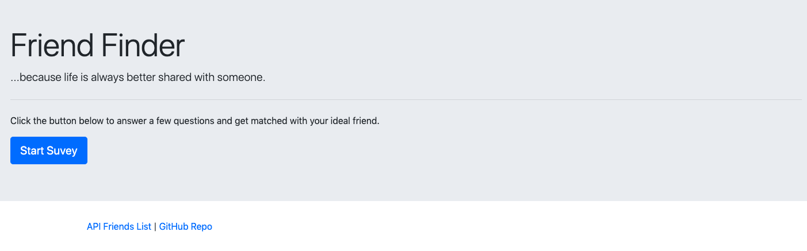
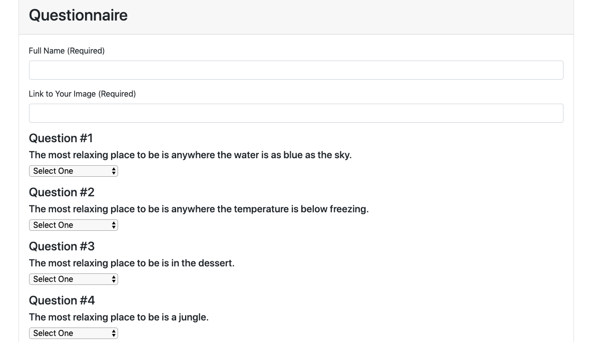
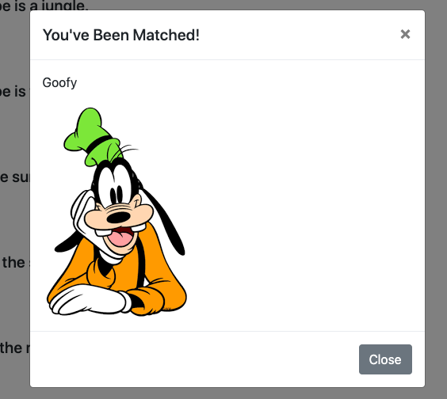
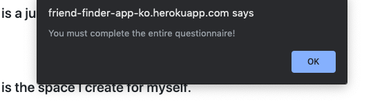

# Friend-Finder

# How to Use
User will click the button to start the survey. Upon completing all the fields and clicking "submit" the user will be "matched" with a friend.

# Behind the Scenes 
Home page provide a brief description and has a button that will take the user to the Questionnaire.

The Questionnaire will require the User to input their name and a link to an image. Below are 10 questions for them to answer. All fields must be completed and all questions answered before results will render.

The User's results are converted into an array and added to our API results of "friends"

The User's scores are totaled and the aboslute value is compared to that of all the exisiting "friends" already listed in our API. The exisiting "friends" are embedded in the code within the Friends.js file.

When a "friend" whose total difference between that and the User is the lowest the "friend" will be displayed in a modal with their name and image.

The Questionnaire is reset and ready for the next entry.

# Screenshots

* Homepage

* Questionnaire

* Results

* All Form Fields Required

# Technologies Used
* JavaScript
* JQuery
* Nodejs
* Node Packages:
    * Path
    * Express
* Git 
* Github
* HTML
* Bootstrap

Application is deployed via Heroku: https://friend-finder-app-ko.herokuapp.com/
